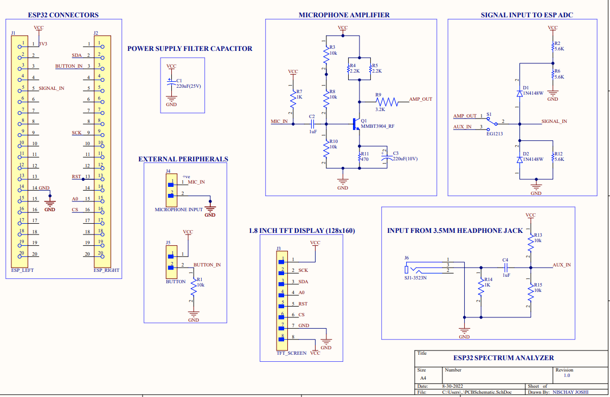

# ESP32-Spectrum-Analyzer
ESP32 Based Spectrum Analyzer, can do 30FPS. Fully customizable. Uses 1.8 inch 128x160 TFT LCD screen and custom built microphone amplifier as audio input.
# Where to find what?
1. PCB: Contains all the files related to the PCB I was developing for the project. It is completed. The gerber files are inside the folder.
2. SpectrumAnalzer: Contains all the code for the project. I have used Arduino IDE. This project was inspired by a few different versions of Spectrum Analyzers on youtube, like <a href="https://www.youtube.com/watch?v=sDC20oJw4W0&ab_channel=Dave%27sGarage"> Dave's Garage</a>, <a href="https://www.youtube.com/watch?v=Mgh2WblO5_c&ab_channel=ScottMarley">Scott Marley</a> and <a href="https://www.youtube.com/watch?v=RnVeXkrrnPI&t=34s&ab_channel=G6EJD-David">G6EJD-David</a>. The i2s configuration for project was referenced from <a href="https://www.youtube.com/watch?v=pPh3_ciEmzs&t=1s&ab_channel=atomic14">Actomic14</a>. These people are awesome, and you should definitely check out their work if you haven't.
# Schematic 

In the schematic above, the ESP is <a href= "https://a.co/d/5JXy166">this</a> one. It has 19pins, the header has 20, use the top 19. Pin 1 on the left side header corresponds to VCC pin on the ESP, and pin 1 in right side header corrsponds to pin GND on the ESP. Also for the ESP orientation, the usb port is towards the bottom end of the headers. 

# Notes
1. As of August 30th 2022, I haven't tried the AUX circuitry. I only have one input that is the Microphone amplifier, and it is fed directly to ADC. However, while designing the circuit for the AUX in, I took into account the average DC voltage of most smarthopne output and simulated the circuit in a SPICE simulator, it works correctly. I just haven't tested it in real life. You are free to do so.  <b>Note: DO NOT APPLY MORE THAN 3.3V AT ESP INPUT PINS WITHOUT THE PROETECTIVE DIODE CIRCUIT. THE ESP WILL MOST LIKELY DIE INSTANTLY!!</b>
2. I am not a software developer or a programmer. Just a 4th year EE student, currently learning embedded systems. If you find some really big blunders or mistakes or bugs, please let me know. I would be grateful to you!
